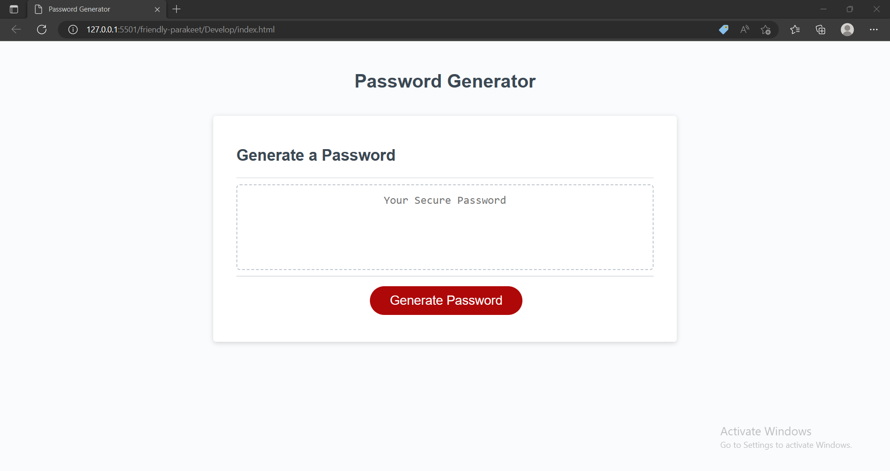

# Javascript-Password-Generator
## Project Description
This project challenges us to generate a password through javascript. My motivation behind this assignment was to carefully structure before coding. I had to draw a process chart and found that to be an easier way of learning what was going on in my javascript. I built this project so I can understand how to use for loops and varibales to generate something. I also had to use while loops for length portion of my javascript. The problem this challenge solves is that I can see what is going on in my script and the values I inputted. I learned how to use variables, how to use loops, and also and/or also known as true/false conditions. My project stands out because I tried my best to make it the most efficient line of code.

## Installation

Clone this repository on your local computer using git clone. And then run the index.html file.

## Usage 

## Deployment Link
https://isaacp5454.github.io/Javascript-Password-Generator/

